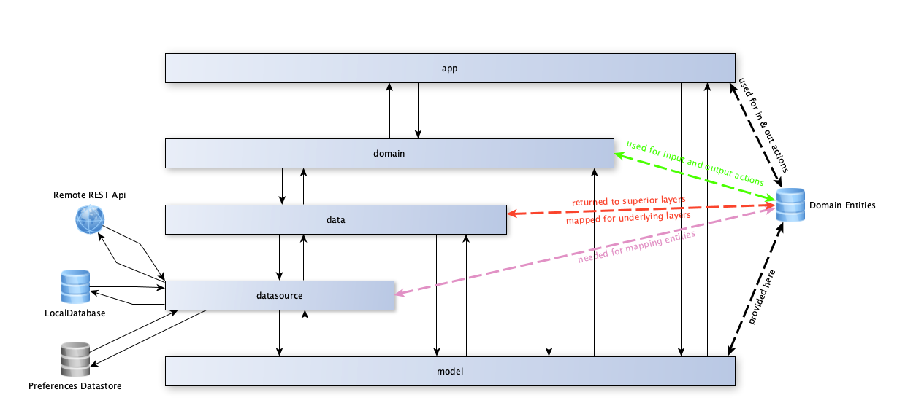

# MVVM Project

## Introducción  

Este proyecto es **mi visión particular**, ni mejor ni peor (sólo una más) que cualquier otra aproximación a lo que
yo entiendo que es una arquitectura [MVVM](https://es.wikipedia.org/wiki/Modelo%E2%80%93vista%E2%80%93modelo_de_vista) diseñada siguiendo las guías [Clean Architecture](https://blog.cleancoder.com/uncle-bob/2012/08/13/the-clean-architecture.html).  

A diferencia de otras implementaciones, yo (insisto en el YO, TÚ puedes tener  - y seguramente tendrás - una idea totalmente
opuesta a la mía) he optado por una separación completa de cada capa, organizando el proyecto en cinco capas claramente 
diferenciadas, en las que unas capas dependen de otras, pero teniendo en cuenta que una capa de nivel superior (léase app)
 no verá (de hecho no sabrá que existe) una capa de nivel inferior (léase data, o datasource).  

## Estructura del proyecto

Este proyecto se estructura en cinco capas (módulos de librería android) independientes, vistas de arriba a abajo:  

- **app**, este es el módulo de presentación. en él se albergan las vistas, ya sean clásicas o compose (el proyecto está 
preparado tanto para crear vistas clásicas como con [Jetpack Compose](https://developer.android.com/jetpack/compose) - se 
ha habilitado por defecto los composables para 
[material3](https://m3.material.io/), aunque se ha dejado comentado el código de dependencia para utilizar 
[material clásico](https://m2.material.io/)).
- **domain**, este es el módulo encargado de centralizar los distintos casos de uso y lógica de negocio necesarios para la 
obtención de datos desde fuentes de datos tanto locales como externas (ya con entidades de dominio) que serán pasados a la 
capa de presentación para su visualización. 
- **data**, esta capa es la responsable de abstraer y organizar las distintas fuentes de datos, teniendo como unas fuentes de 
entrada y salida de objetos, elementos de dominio, internamente, gracias a los mapeadores proporcionados por cada entidad 
cache o remote, puede realizar las acciones pertinentes (envío a sistemas externos, persistencia local, etc.). 
- **datasource**, en esta capa disponemos de todas las fuentes de datos posibles de nuestra app, esto incluye persistencia 
local con room, externa con retrofit (hay ejemplos en el código), y la abstracción de acceso al nuevo sistema de almacenamiento
de preferencias de android, esto es, [Jetpack Datastore](https://developer.android.com/topic/libraries/architecture/datastore)
- **model**, esta capa es transversal al resto, y **es la única visible por todas las demás**. Contiene las entidades de dominio,
así como interfaces y métodos de extensión que son de utilidad en todo el proyecto.  

## Características y funcionalidades implementadas

Este proyecto, incluye de base una serie de características y funcionalidades que nos van a permitir simplemente preocuparnos 
de los cambios de nombre de los *package name* del proyecto. Pasemos a enumerar las distintas funcionalidades/características 
disponibles:  

- Test Unitarios con [JUnit5](https://junit.org/junit5/). Se implementa el desarrollo de [Marcel Schnelle](https://github.com/mannodermaus/android-junit5), 
así como las funciones de extensión e infix de [Kluent](https://markusamshove.github.io/Kluent/).
- [Corutinas](https://developer.android.com/kotlin/coroutines). Todo el proyecto está implementando pensando en la 
utilización de corutinas a todos los niveles.
- [Flow](https://developer.android.com/kotlin/flow). Ya que utilizamos corutinas, ¿por qué no utilizar flows, 
que son el nuevo estandar? Esto implica que no se han agregado dependencias para [LiveData](https://developer.android.com/topic/libraries/architecture/livedata)
- [Jetpack Datastore](https://developer.android.com/topic/libraries/architecture/datastore). Es el nuevo sistema de almacenamiento reactivo
de preferencias en apps android, en detrimento de las obsoletas y síncronas [SharedPreferences](https://developer.android.com/training/data-storage/shared-preferences).
- Persistencia local con [Room](https://developer.android.com/jetpack/androidx/releases/room). Room es el ORM de facto para android, por lo que no hay mucho más que agregar. El proyecto
viene preparado incluso para la gestión sencilla de migraciones.
- Acceso a [APIs REST](https://es.wikipedia.org/wiki/Transferencia_de_Estado_Representacional) con [Retrofit](https://square.github.io/retrofit/).
- Provisión de dependencias con [Koin](https://insert-koin.io/). Para esta versión del proyecto, se ha utilizado como proveedor
de dependencias (que no inyector) el framework de Koin. En el repo [MVVM Project Hilt](https://github.com/afalabarce/MVVMProject-Hilt) he realizado la misma implementación pero con 
[Dagger-Hilt](https://developer.android.com/training/dependency-injection/hilt-android).  
  Este proyecto implementa de una forma bastante particular la provisión de dependencias de Koin, ya que cada capa dispone de su propia colección 
  de modules de Koin, propagándose hacia capas superiores mediante la llamada a un método muy partícular (esto lo veremos en profundidad en la sección siguiente). 
- Integración en capa de presentación de libería [Coil](https://coil-kt.github.io/coil/) para presentación asíncrona de imágenes.
- [Jetpack Compose](https://developer.android.com/jetpack/compose) con composables [material3](https://m3.material.io). Aunque se ha 
dejado comentada la dependencia para la utilización de [material2](https://m2.material.io)
- [Animated Navigation Compose](https://google.github.io/accompanist/navigation-animation/). Si bien aún forma parte de las 
librerías accompanist (versiones en desarrollo) son estables.
- Integración con vistas clásicas. En este punto no hay mucho que contar, cualquier proyecto android siempre va a soportar vistas clásicas.
- Dependencias para [Autenticación biométrica](https://developer.android.com/jetpack/androidx/releases/biometric).
- Diversos controles de [accompanist](https://github.com/google/accompanist). Son controles en fase de pruebas, pero totalmente usables:
  - [Gestión de permisos con componentes accompanist](https://google.github.io/accompanist/permissions/). Una forma muchísimo más cómoda
  de gestionar permisos de usuario. Totalmente integrado con Jetpack Compose.
  - [Pager de Accompanist](https://google.github.io/accompanist/pager/). Sistema de paginación para compose.
  - [SwipeToRefresh](https://google.github.io/accompanist/swiperefresh/).
- Implementación de diversas funcionalidades de Java8, gracias a la implementación de [coreLibraryDesugar](https://developer.android.com/studio/write/java8-support).

## Descripción de funcionalidades más representativas

En el punto anterior hemos podido ver que el proyecto integra de base numerosas funcionalidades, las cuales, en su inmensa mayoría son funciones, 
o frameworks estandar con una documentación extremadamente completa, por lo que escapa al alcance de este documento.  
En cambio, sí vamos a ver lo que hace diferente al proyecto, y que, en mi humilde opinión, beneficia y acelera el desarrollo de una nueva app.

### 1. Inyección de dependencias con Koin

Este proyecto, como hemos comentado utiliza Koin como proveedor de dependencias, que en la versión utilizada (no implementa [Koin Annotations](https://insert-koin.io/docs/reference/koin-annotations/annotations))
sino la forma clásica de Koin), en teoría app debería tener acceso a todas las capas en las que se van a realizar mapeos ya que hay que pasarle todas 
las llamadas necesarias con sus respectivos controladores.  
Esto a mi juicio, choca frontalmente con la separación por capas que se promueve en las guías de 
Clean Architecture, permitiendo por ejemplo, que un programador, malintencionado o no, utilice métodos 
y / o clases en una capa que no está pensada para ese uso. Con el sistema que he implementado, esto no sucede, ya que 
desde una capa superior no se puede acceder a una capa inferior (desde presentación no se puede acceder a data o datasource).  
Lo descrito en el párrafo anterior queda claramente definido en el siguiente esquema:

  

Para implementar los inyectores de dependencia, en cada capa deberá existir un package llamado "**di**" 
que será el que contenga la clase que implementará las dependencias de la capa anterior, unida a la capa actual, por ejemplo,
pensemos en la capa **data**, queremos inyectar sus propias dependencias, además de las de datasource (**que deberán ir primero** para
evitar problemas de inyección, ya que **Koin requiere de orden en función de las dependencias entre clases**).

```kotlin
package io.github.afalalabarce.mvvmproject.data.di

import android.content.Context
import io.github.afalalabarce.mvvmproject.data.datastore.PreferencesDatastoreRepository
import io.github.afalalabarce.mvvmproject.data.features.example.factory.ExampleEntityDataStoreFactory
import io.github.afalalabarce.mvvmproject.data.features.example.implementation.ExampleCacheDataStoreImpl
import io.github.afalalabarce.mvvmproject.data.features.example.implementation.ExampleRemoteDataStoreImpl
import io.github.afalalabarce.mvvmproject.data.features.example.interfaces.ExampleDataStore
import io.github.afalalabarce.mvvmproject.datasource.di.DataSourceDependencyInjector
import io.github.afalalabarce.mvvmproject.model.interfaces.IKoinModuleLoader
import org.koin.core.module.Module
import org.koin.core.qualifier.named
import org.koin.dsl.module

class DataDependencyInjector: IKoinModuleLoader {
    override fun getKoinModules(context: Context): List<Module> {
        return DataSourceDependencyInjector().getKoinModules(context)
            .union(listOf(
                module {
                    factory { PreferencesDatastoreRepository(get()) }

                    // TODO Add some factory, single, etc. Koin definitions
                    factory<ExampleDataStore>(named("cache")) { ExampleCacheDataStoreImpl(get()) }
                    factory<ExampleDataStore>(named("remote")) { ExampleRemoteDataStoreImpl(get(), get()) }
                    factory { ExampleEntityDataStoreFactory(get(named("cache")), get(named("remote"))) }
                },
            )
        ).toList()
    }
}
```  
En el código anterior vemos que la clase **DataDependencyInjector** implementa la interfaz **IKoinModuleLoader**
la cual define un método getKoinModules, como podemos ver, en primer lugar llamamos al proveedor de dependencia de la 
capa datasource (llamado **DataSourceDependencyInjector**), para a continuación, agregar sus propias dependencias, 
mediante la función de extensión union.  
De este modo, conseguimos que todas las dependencias vayan en el orden adecuado, además de disponer de un mapa de 
dependencias más claro, ya que cada capa sólo implementa las suyas propias.  

Este proceso, se repetirá en cada capa, hasta llegar a la capa de presentación, la cual, después de sobreescribir 
el application, éste nos quedaría como sigue:

```kotlin
package io.github.afalalabarce.mvvmproject

import androidx.multidex.MultiDexApplication
import io.github.afalalabarce.mvvmproject.di.ApplicationDependencyInjector
import org.koin.android.ext.koin.androidContext
import org.koin.android.ext.koin.androidLogger
import org.koin.core.context.GlobalContext

class CustomApplication: MultiDexApplication() {
    override fun onCreate() {
        super.onCreate()

        GlobalContext.startKoin {
            androidLogger()
            androidContext(this@CustomApplication)
            modules(ApplicationDependencyInjector().getKoinModules(this@CustomApplication.applicationContext))
        }

    }
}
```  

Como podemos ver, en nuestro CustomApplication tan solo debemos inyectar los módulos de application 
(este ya lleva el resto de los módulos de las distintas capas).

### 2. Mapeo de Entidades Cache - Remote - Domain

Otra de las problemáticas de las implementaciones Clean Architecture está en decidir qué modelado de entidades se va a seguir.  
En un modelo clásico de implementación en el que nuestra aplicación dispone de orígenes de datos remotos y almacenamiento local,
lo más común es definir tres tipos de entidades, cada una con sus peculiaridades:  
- **remote**, este tipo de entidad permite obtener datos de un origen de datos remoto, obtenidos, por ejemplo, con Retrofit. Estos
datos van a tener una estructuta que va a venirnos impuesta por el servicio backend, por lo que probablemente no se adecúe a nuestras
necesidades particulares, simplemente necesitamos obtenerlos del sistema remoto con la estructura dada.
- **cache**, este tipo de entidad permite gestionar datos propios en nuestra base de datos, van a tener una estructura atómica, es decir, 
campos con tipos de datos primitivos, que van a ser almacenados en la base de datos (como curiosidad, se han agregado TypeConverters 
que van a permitirnos establecer ciertos datos en las entidades de caché que no son primitivos, como por ejemplo, Instant, enumerados, etc.).
- **pojos**, son una abstracción que nos permite Room, y que, de forma sencilla permite enlazar mediante relaciones entidades de caché en 
tipos más complejos. En el caso de que necesitemos en dominio entidades complejas, es buena idea utilizar POJOs como entidades de mapeo,
en lugar de las entidades básicas.
- **domain**, este tipo de entidad es el que se va a utilizar en las capas superiores de la app. A partir de la capa **data** todo lo que se comunique
como entrada y salida de sus métodos serán entidades de dominio (internamente utilizará las entidades de cache, pojos o remote necesarias para realizar
su trabajo).  

En el proyecto, se han definido una serie de interfaces y clases abstractas que van a permitirnos de una forma muy simple realizar los
mapeos entre los distintos tipos de entidad, de forma que incluso Koin no se vea perjudicado, incidiendo por tanto en el rendimiento de 
nuestra app.  

En un sistema clásico de mapeo, se crearían clases mapeadoras para cada entidad, que serían dependientes unas de otras,
con los posibles problemas que podría ocasionarnos con Koin, además de que tendríamos una cantidad de código más complejo de mantener.
Con esta implementación una entidad tiene "todos sus mapeadores dentro de ella misma", por lo que no depende de entidades externas,
más allá de la dependencia con las clases remote o domain (en el caso de tratarse de entidades de caché) y viceversa.  

A partir de la introducción dada, veamos los distintos tipos de clases abstractas e interfaces implicadas en el proceso:

#### IDomain

IDomain está implementada en el módulo **model**, en el package *io.github.afalalabarce.mvvmproject.model.interfaces*,
siendo su utilidad marcar una data class como que es una entidad de dominio. Veamos un ejemplo de definición de entidad 
de dominio:

```kotlin
package io.github.afalalabarce.mvvmproject.model.domain

import io.github.afalalabarce.mvvmproject.model.interfaces.IDomain

data class ExampleDomainEntity(
  val id: Long,
  val code: String,
  val name: String,
): IDomain
```  

#### IMapperEntity

Esta interfaz está definida en el proyecto **datasource** con la intención de que **las clases que implementen esta interfaz
no sean accesibles por capas de nivel superior** (sólo serán accesibles por su capa inmediatamente superior, esto es, **data**).
Al igual que IDomain, **es una interfaz hueca**.

#### ICacheEntity  

ICacheEntity es una clase abstracta que nos va a permitir gestionar los mapeos de entidades de Cache a los otros tipos de entidad,
es decir, una data class que implemente esta clase abstracta, va a poder mapear su instancia a domain o remote, y desde domain a caché
mediante una función estática. Su implementación es la siguiente:  

```kotlin
package io.github.afalalabarce.mvvmproject.datasource.mapper

import io.github.afalalabarce.mvvmproject.model.interfaces.IDomain

abstract class ICacheEntity<R: IMapperEntity, D: IDomain>: IMapperEntity {
    abstract fun toRemote(): R
    abstract fun toDomain(): D

    companion object{
        fun <D: IDomain, C: IMapperEntity>fromDomain(domainEntity:D, domainEntityConversion: (D) -> C): C = domainEntityConversion(domainEntity)
    }
}
```  

Veamos a continuación un ejemplo de implementación que nos permite utilizar dicha clase abstracta,
en este caso, una data class diseñada para persistencia local con Room:

```kotlin
package io.github.afalalabarce.mvvmproject.datasource.cache.model

import androidx.room.ColumnInfo
import androidx.room.Entity
import androidx.room.PrimaryKey
import io.github.afalalabarce.mvvmproject.datasource.mapper.ICacheEntity
import io.github.afalalabarce.mvvmproject.datasource.remote.model.RemoteExampleEntity
import io.github.afalalabarce.mvvmproject.model.domain.ExampleDomainEntity

@Entity(
    tableName = "example_entities"
)
data class CacheExampleEntity(
    @PrimaryKey(autoGenerate = true)
    @ColumnInfo(name ="entity_id")
    val id: Long,
    @ColumnInfo(name = "entity_code")
    val code: String,
    @ColumnInfo(name = "entity_name")
    val name: String,
): ICacheEntity<RemoteExampleEntity, ExampleDomainEntity>() {
    override fun toRemote(): RemoteExampleEntity = RemoteExampleEntity(
        id = this.id,
        code = this.code,
        name = this.name,
        description = this.name,
    )

    override fun toDomain(): ExampleDomainEntity = ExampleDomainEntity(
        id = this.id,
        code = this.code,
        name = this.name,
    )

    companion object{
        fun fromDomain(domainEntity: ExampleDomainEntity): CacheExampleEntity = ICacheEntity.fromDomain(domainEntity){ d ->
            CacheExampleEntity(
                id = d.id,
                code = d.code,
                name = d.name,
            )
        }
    }
}
```  

Como podemos ver, disponemos del mapeo a entidad Remote y Domain, además de forma estática disponemos del método *fromDomain*
que nos permite mapear desde una entidad de dominio a Caché de forma muy sencilla:

```kotlin
override fun addOrUpdateExampleEntity(vararg exampleEntity: ExampleDomainEntity): Flow<List<ExampleDomainEntity>> = flow {
        val updatedOrInsertedIds = this@ExampleCacheDataStoreImpl.appDatabase.dao().addOrUpdateExampleEntity(
            *exampleEntity.map { e -> CacheExampleEntity.fromDomain(e) }.toTypedArray()
        )
        emitAll(
            this@ExampleCacheDataStoreImpl.appDatabase.dao().getExampleEntitiesByIds(updatedOrInsertedIds)
                    .map { x ->
                        x.map { y -> y.toDomain() }
                    }
        )
    }
```  
Este código forma parte del fichero **ExampleCacheDataStoreImpl** (capa **data**, *features, example, implementation*)  

#### IRemoteEntity  

Esta clase abstracta es la contraparte de ICacheEntity, su funcionalidad es exactamente la misma, pero pensada y diseñada para entidades de datos remotos.  
Al igual que ICacheEntity, implementa IMapperEntity, siendo su código fuente el siguiente:

```kotlin
package io.github.afalalabarce.mvvmproject.datasource.mapper

import io.github.afalalabarce.mvvmproject.model.interfaces.IDomain

abstract class IRemoteEntity<C: IMapperEntity, D: IDomain> : IMapperEntity {
    abstract fun toCacheEntity(): C
    abstract fun toDomain(): D

    companion object{
        fun <D: IDomain, R: IMapperEntity>fromDomain(domainEntity:D, domainEntityConversion: (D) -> R): R = domainEntityConversion(domainEntity)
    }
}
```  

Como vemos, la implementación es muy similar a ICacheEntity (sólo cambia el método toRemoteEntity por el método toCacheEntity).  
Su utilización es exactamente igual a ICacheEntity. Veamos un ejemplo:

```kotlin
package io.github.afalalabarce.mvvmproject.datasource.remote.model

import com.google.gson.annotations.SerializedName
import io.github.afalalabarce.mvvmproject.datasource.cache.model.CacheExampleEntity
import io.github.afalalabarce.mvvmproject.datasource.mapper.ICacheEntity
import io.github.afalalabarce.mvvmproject.datasource.mapper.IRemoteEntity
import io.github.afalalabarce.mvvmproject.model.domain.ExampleDomainEntity
import io.github.afalalabarce.mvvmproject.model.exception.IllegalMappingException

data class RemoteExampleEntity(
    @SerializedName("remote_field_id") val id: Long,
    @SerializedName("remote_field_code") val code: String,
    @SerializedName("remote_field_name") val name: String,
    @SerializedName("remote_field_description") val description: String,
): IRemoteEntity<CacheExampleEntity, ExampleDomainEntity>() {
    override fun toCacheEntity(): CacheExampleEntity = CacheExampleEntity(
        id = this.id,
        code = this.code,
        name = this.name,
    )

    override fun toDomain(): ExampleDomainEntity {
        throw IllegalMappingException("${this.javaClass.simpleName} can't be mapped to Domain Entity")
    }

    companion object{
        fun fromDomain(domainEntity: ExampleDomainEntity): RemoteExampleEntity = ICacheEntity.fromDomain(domainEntity){ d ->
            throw IllegalMappingException("RemoteExampleEntity can't be mapped from Domain Entity")
        }
    }
}
```  

Como podemos ver en el código anterior, implementamos el mapeo a su correspondiente entidad de caché, en cambio
en este caso (no tiene porqué suceder siempre) no implementamos mapeo a entidad de dominio, provocando una excepción 
**IllegalMappingException** (definida en la capa **model**).  

De este modo, nos protegemos ante intentos de mapeo ilegales
(recordemos que un desarrollador de la capa data no podría no tener acceso a la capa datasource, por lo que protegemos la implementación).

La utilización por parte de los mapeadores, es idéntica a las entidades de caché. Un ejemplo de uso podría ser el siguiente:  

```kotlin
override fun getAllExampleEntities(): Flow<List<ExampleDomainEntity>> = flow {
        try{
            val resultRemote = this@ExampleRemoteDataStoreImpl.remoteService.getRemoteEntity()
            if (resultRemote.isSuccessful){
                val cacheExampleEntities = resultRemote.body()?.let { rData ->
                    rData.map { r -> r.toCacheEntity() }
                } ?: listOf()
                // in real life, we need a mechanism to control if we need to download or not some data from remote sources
                this@ExampleRemoteDataStoreImpl.appDatabase.dao().addOrUpdateExampleEntity(*cacheExampleEntities.toTypedArray())

                emitAll(
                    this@ExampleRemoteDataStoreImpl.appDatabase.dao().getAllExampleEntities().map { entities ->
                        entities.map { e -> e.toDomain() }
                    }
                )
            }
        }catch (_: Exception){
            emit(listOf())
        }
    }
```  
El trozo de código anterior está disponible en la capa **data**, *features, example, implementation, ExampleRemoteDataStoreImpl*.   

#### Valoración final del sistema de mapeo.  

Como podemos ver, este sistema de mapeo es bastante simple, a la par que potente (creo), nos permite gestionar el intercambio de datos 
entre distintos orígenes de datos de forma muy sencilla, además descarga de trabajo al proveedor de dependencias, por lo que el rendimiento
debe ser bastante mejor que implementando mapeadores "clásicos".  
Por tanto, quizá es una idea que puede ser tenida en cuenta para tus desarrollos (o no ;D).

### 3. Gestión de preferencias con Jetpack DataStore  

Por último, pero no menos importante, tenemos el caballo de batalla de toda app, esto es, el almacenamiento cacheado
(no en bases de datos al uso como Room) de ciertos parámetros de la app. Como todos sabemos, desde que Android es Android 
siempre hemos tenido disponible en el sdk el acceso a las SharedPreferences como almacén de datos de configuración, etc..  

SharedPreferences no estaba mal, pero tiene un problema de base, su gestión es síncrona, lo que interfiere enormemente con
la asignación de configuraciones a la app, dejando al desarrollador muchísima responsabilidad en su gestión.  

A día de hoy, en el paquete Android Jetpack (no confundir con Compose) se ha agregado un nuevo sistema llamado DataStore, el cual permite de forma
reactiva el acceso y modificación de parámetros de configuración, descargando al desarrollador de la responsabilidad de recargar datos, es decir,
el programador tan solo va a tener que preocuparse de suscribir un flujo (Flow) a la configuración para tenerla siempre actualizada.

En este proyecto, y ya que DataStore es otro origen de datos más, he situado su implementación en la capa **datasource*, teniendo por tanto su
inyección de dependencia a data, domain y app.  

Se ha implementado de forma muy simple, pero en implementaciones más complejas, quizá interese crear una entidad Settings con todos los parámetros
y en la capa data que esta sea la responsable de construir un Flow a partir de cada dato atómico.

A continuación se muestra la implementación de DataStore situada en la capa datasource del proyecto:  

```kotlin
package io.github.afalalabarce.mvvmproject.datasource.datastore

import android.content.Context
import androidx.datastore.preferences.core.edit
import androidx.datastore.preferences.core.stringPreferencesKey
import androidx.datastore.preferences.preferencesDataStore
import kotlinx.coroutines.CoroutineScope
import kotlinx.coroutines.Dispatchers
import kotlinx.coroutines.flow.Flow
import kotlinx.coroutines.flow.map
import kotlinx.coroutines.launch

class PreferencesDataStore(
    private val context: Context
) {
    fun getDeviceId(): Flow<String> = this@PreferencesDataStore.context.dataStore.data.map { pref ->
        pref[stringPreferencesKey("DeviceId")] ?: ""
    }

    fun setDeviceId(deviceId: String) = CoroutineScope(Dispatchers.IO).launch {
        this@PreferencesDataStore.context.dataStore.edit { prefs ->
            val currentDeviceId = prefs[stringPreferencesKey("DeviceId")] ?: ""
            if (currentDeviceId.isNullOrEmpty())
                prefs[stringPreferencesKey("DeviceId")] = deviceId
        }
    }
}

private val Context.dataStore by preferencesDataStore("MVVMProjectAppPreferences")
```   

Como podemos apreciar, se requiere de un Context, por tanto, y gracias a nuestro proveedor de dependencias no 
tenemos que preocuparnos, él nos lo proporciona.

Como curiosidad, podemos ver que creamos de forma privada una extensión a Context llamada dataStore al que de forma
perezosa le asignamos un preferencesDataStore con el nombre que le queramos dar (esto en tu app, cámbialo ;))  

Por lo demás el código no tiene mucho misterior, las obtenciones de datos se realizan mediante Flow, y las asignaciones
mediante corrutinas, por lo que tenemos garantizada la asincronía y la reactividad.  

Para más información sobre DataStore, te recomiendo que mires su [referencia del desarrollador](https://developer.android.com/topic/libraries/architecture/datastore).

# Esto es todo, GRACIAS por leerte todo el mamotreto ;)

Y si piensas que he hecho un buen trabajo y me merezco un café puedes hacer un [PaypalMe](https://www.paypal.com/paypalme/afalabarce)


